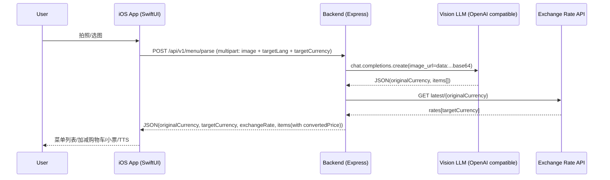

# AI Menu 项目 Code Wiki

> 2026-05-02 更新：项目已迁移出一套原生微信小程序客户端，当前主客户端入口为 `miniprogram/`，微信开发者工具打开仓库根目录即可识别。原 iOS 工程暂时保留为 legacy 参考，未直接删除。

本仓库当前包含三部分：

- 微信小程序客户端：原生小程序（目录：[miniprogram](file:///Users/meimei/Desktop/ai%E8%8F%9C%E5%8D%95/ai%20menu/miniprogram)）
- iOS 客户端：Swift / SwiftUI（目录：[ai menu](file:///Users/meimei/Desktop/ai%E8%8F%9C%E5%8D%95/ai%20menu/ai%20menu)）
- 后端服务：Node.js / Express（目录：[backend](file:///Users/meimei/Desktop/ai%E8%8F%9C%E5%8D%95/ai%20menu/backend)）

核心目标：用户拍摄/导入餐厅菜单图片，后端调用视觉大模型将菜单结构化并翻译，同时把价格按汇率换算为用户本地币种；小程序端展示菜单、支持加减购物车、生成小票并复制点单原文。

## 0. 微信小程序迁移入口

- 工程配置：[project.config.json](file:///Users/meimei/Desktop/ai%E8%8F%9C%E5%8D%95/ai%20menu/project.config.json)
- 小程序根目录：[miniprogram](file:///Users/meimei/Desktop/ai%E8%8F%9C%E5%8D%95/ai%20menu/miniprogram)
- 运行说明：[README_MINIPROGRAM.md](file:///Users/meimei/Desktop/ai%E8%8F%9C%E5%8D%95/ai%20menu/README_MINIPROGRAM.md)

页面映射：

- `pages/index`：拍照/相册导入，调用 `wx.uploadFile` 上传到后端解析
- `pages/menu`：菜单分类、搜索、购物车、金额汇总
- `pages/receipt`：小票和点单原文复制

## 目录导航

- [1. 仓库结构](#1-仓库结构)
- [2. 整体架构](#2-整体架构)
- [3. iOS 客户端（SwiftUI）](#3-ios-客户端swiftui)
  - [3.1 启动与页面状态机](#31-启动与页面状态机)
  - [3.2 主要模块职责](#32-主要模块职责)
  - [3.3 核心数据模型](#33-核心数据模型)
  - [3.4 关键类与函数](#34-关键类与函数)
  - [3.5 关键交互流程](#35-关键交互流程)
- [4. 后端服务（Node.js / Express）](#4-后端服务nodejs--express)
  - [4.1 启动与路由](#41-启动与路由)
  - [4.2 核心接口与数据结构](#42-核心接口与数据结构)
  - [4.3 大模型调用与解析策略](#43-大模型调用与解析策略)
  - [4.4 汇率换算](#44-汇率换算)
- [5. 依赖关系](#5-依赖关系)
  - [5.1 iOS 端依赖](#51-ios-端依赖)
  - [5.2 后端依赖](#52-后端依赖)
- [6. 运行方式](#6-运行方式)
  - [6.1 运行后端](#61-运行后端)
  - [6.2 运行 iOS App](#62-运行-ios-app)
  - [6.3 常见问题](#63-常见问题)
- [7. 测试与工程结构](#7-测试与工程结构)

## 1. 仓库结构

```
.
├─ ai menu/                       # iOS App 源码（Swift/SwiftUI）
│  ├─ ai_menuApp.swift            # iOS 入口（AppDelegate + UIHostingController）
│  ├─ ContentView.swift           # 根视图：引导/处理中/菜单页切换
│  ├─ Models/
│  │  └─ MenuModels.swift         # 菜单/订单领域模型 + 解码结构
│  ├─ Services/
│  │  ├─ APIService.swift         # 后端 API 调用（multipart 上传图片）
│  │  └─ TTSManager.swift         # 语音播报（AVSpeechSynthesizer）
│  ├─ ViewModels/
│  │  └─ MenuViewModel.swift      # 业务编排：解析菜单、购物车、错误与状态
│  ├─ Views/Components/
│  │  ├─ ImagePicker.swift        # UIImagePickerController 封装
│  │  ├─ MenuListView.swift       # 菜单列表 + 分类 + 搜索 + 购物车入口
│  │  ├─ ProcessingView.swift     # 处理中遮罩
│  │  └─ ReceiptView.swift        # 小票页 + TTS 播报控制
│  └─ *.lproj/Localizable.strings # 中英文本地化
├─ backend/                       # Node.js 后端
│  ├─ index.js                    # Express 入口：/health 与 /api/v1/menu/parse
│  ├─ package.json                # 依赖与脚本（start/dev）
│  ├─ .env                        # 本地环境变量（示例为占位符）
│  └─ .env.example                # 环境变量模板
├─ ai menu.xcodeproj/             # Xcode 工程
├─ ai menuTests/                  # 单测 Target（骨架）
└─ ai menuUITests/                # UI 测试 Target（骨架）
```

## 2. 整体架构

### 2.1 分层与边界

- iOS 端：典型 SwiftUI + ViewModel（状态与业务逻辑集中在 `MenuViewModel`）
- 后端：轻量 Express 服务，负责
  - 接收图片上传
  - 调用视觉大模型进行“菜单结构化 + 翻译”
  - 汇率换算并补全 `convertedPrice`
  - 将结构化 JSON 返回给 App

### 2.2 端到端数据流



## 3. iOS 客户端（SwiftUI）

### 3.1 启动与页面状态机

- App 入口使用 `@main` 的 `AppDelegate`，创建 `UIHostingController(rootView: ContentView())`
  - 代码位置：[ai_menuApp.swift](file:///Users/meimei/Desktop/ai%E8%8F%9C%E5%8D%95/ai%20menu/ai%20menu/ai_menuApp.swift#L4-L17)
- `ContentView` 根据 `MenuViewModel` 状态切换界面：
  - `isProcessing == true` → `ProcessingView`
  - `menuItems` 非空 → `MenuListView`
  - 否则 → 引导页 `CameraIntroView`
  - 代码位置：[ContentView.swift](file:///Users/meimei/Desktop/ai%E8%8F%9C%E5%8D%95/ai%20menu/ai%20menu/ContentView.swift#L10-L55)

### 3.2 主要模块职责

- Views
  - [ContentView.swift](file:///Users/meimei/Desktop/ai%E8%8F%9C%E5%8D%95/ai%20menu/ai%20menu/ContentView.swift)：根视图与拍照/相册入口，触发解析任务
  - [MenuListView.swift](file:///Users/meimei/Desktop/ai%E8%8F%9C%E5%8D%95/ai%20menu/ai%20menu/Views/Components/MenuListView.swift)：菜单展示（分组/搜索）、加减购物车、下单入口
  - [ReceiptView.swift](file:///Users/meimei/Desktop/ai%E8%8F%9C%E5%8D%95/ai%20menu/ai%20menu/Views/Components/ReceiptView.swift)：小票展示、播报控制（播放/停止）
  - [ImagePicker.swift](file:///Users/meimei/Desktop/ai%E8%8F%9C%E5%8D%95/ai%20menu/ai%20menu/Views/Components/ImagePicker.swift)：系统图片选择器封装（相机/相册）
  - [ProcessingView.swift](file:///Users/meimei/Desktop/ai%E8%8F%9C%E5%8D%95/ai%20menu/ai%20menu/Views/Components/ProcessingView.swift)：处理中状态的遮罩与提示

- ViewModels
  - [MenuViewModel.swift](file:///Users/meimei/Desktop/ai%E8%8F%9C%E5%8D%95/ai%20menu/ai%20menu/ViewModels/MenuViewModel.swift)：整个 App 的业务编排中心（解析、错误、购物车、返回首页）

- Services
  - [APIService.swift](file:///Users/meimei/Desktop/ai%E8%8F%9C%E5%8D%95/ai%20menu/ai%20menu/Services/APIService.swift)：与后端的网络协议（multipart 上传图片，解码 JSON）
  - [TTSManager.swift](file:///Users/meimei/Desktop/ai%E8%8F%9C%E5%8D%95/ai%20menu/ai%20menu/Services/TTSManager.swift)：语音合成与播放状态管理

- Models
  - [MenuModels.swift](file:///Users/meimei/Desktop/ai%E8%8F%9C%E5%8D%95/ai%20menu/ai%20menu/Models/MenuModels.swift)：菜单/订单领域模型与后端返回结构

### 3.3 核心数据模型

后端返回会被解码为 `MenuParseResponse`：

- `originalCurrency: String`
- `targetCurrency: String`
- `exchangeRate: Double`
- `items: [MenuItem]`

其中 `MenuItem` 关键字段：

- `category: String?`：大模型翻译后的分类（可为空）
- `originalName: String`：菜单原文名称（未翻译）
- `translatedName: String`：翻译后的菜名
- `originalPrice: Double`
- `convertedPrice: Double`

源码位置：[MenuModels.swift](file:///Users/meimei/Desktop/ai%E8%8F%9C%E5%8D%95/ai%20menu/ai%20menu/Models/MenuModels.swift#L3-L25)

订单侧模型：

- `OrderItem(menuItem, quantity)`
- `Order(items)`：提供 `totalConvertedPrice` 与 `totalOriginalPrice`

源码位置：[MenuModels.swift](file:///Users/meimei/Desktop/ai%E8%8F%9C%E5%8D%95/ai%20menu/ai%20menu/Models/MenuModels.swift#L27-L44)

### 3.4 关键类与函数

#### 3.4.1 MenuViewModel（业务编排）

文件：[MenuViewModel.swift](file:///Users/meimei/Desktop/ai%E8%8F%9C%E5%8D%95/ai%20menu/ai%20menu/ViewModels/MenuViewModel.swift)

- `processImage(_:)`：主业务入口（图片 → 调后端 → 写入状态）
  - 读取本地语言与币种：
    - `lang = normalizedLanguageTag(Bundle.main.preferredLocalizations.first)`
    - `currency = Locale.current.currency?.identifier ?? "CNY"`
  - 调用后端：
    - `APIService.shared.parseMenu(image:targetLang:targetCurrency:)`
  - 成功：刷新 `menuItems/originalCurrency/targetCurrency/exchangeRate` 并清空购物车
  - 失败：写 `errorMessage`，并写入 Demo 菜单数据用于 UI 继续可用
  - 源码位置：[MenuViewModel.swift](file:///Users/meimei/Desktop/ai%E8%8F%9C%E5%8D%95/ai%20menu/ai%20menu/ViewModels/MenuViewModel.swift#L23-L53)

- `normalizedLanguageTag(_:)`：将 iOS 语言标签映射为后端期望的标签（例如 `zh-Hans` → `zh-CN`）
  - 源码位置：[MenuViewModel.swift](file:///Users/meimei/Desktop/ai%E8%8F%9C%E5%8D%95/ai%20menu/ai%20menu/ViewModels/MenuViewModel.swift#L55-L62)

- 购物车相关：
  - `addToCart(item:)` / `removeFromCart(item:)`
  - `quantity(for:)`
  - `clearCart()`
  - 源码位置：[MenuViewModel.swift](file:///Users/meimei/Desktop/ai%E8%8F%9C%E5%8D%95/ai%20menu/ai%20menu/ViewModels/MenuViewModel.swift#L64-L88)

- `resetToHome()`：返回首页并清空状态（菜单、购物车、选图、错误、处理状态）
  - 源码位置：[MenuViewModel.swift](file:///Users/meimei/Desktop/ai%E8%8F%9C%E5%8D%95/ai%20menu/ai%20menu/ViewModels/MenuViewModel.swift#L90-L96)

#### 3.4.2 APIService（网络协议）

文件：[APIService.swift](file:///Users/meimei/Desktop/ai%E8%8F%9C%E5%8D%95/ai%20menu/ai%20menu/Services/APIService.swift)

- `baseURL = "http://127.0.0.1:3000/api/v1"`
  - 该地址适用于 iOS Simulator 访问本机后端；真机运行通常需要改成“电脑局域网 IP”或公网域名
  - 源码位置：[APIService.swift](file:///Users/meimei/Desktop/ai%E8%8F%9C%E5%8D%95/ai%20menu/ai%20menu/Services/APIService.swift#L4-L7)

- `parseMenu(image:targetLang:targetCurrency:)`
  - 请求：multipart/form-data
    - `image`: menu.jpg（JPEG）
    - `targetLang`
    - `targetCurrency`
  - 响应：JSON → `MenuParseResponse`
  - 源码位置：[APIService.swift](file:///Users/meimei/Desktop/ai%E8%8F%9C%E5%8D%95/ai%20menu/ai%20menu/Services/APIService.swift#L8-L60)

#### 3.4.3 TTSManager（播报）

文件：[TTSManager.swift](file:///Users/meimei/Desktop/ai%E8%8F%9C%E5%8D%95/ai%20menu/ai%20menu/Services/TTSManager.swift)

- `playOrder(items:originalCurrency:)`
  - 将订单拼接为 “{数量} x {原文菜名}” 的语句串
  - 通过 `originalCurrency` 做一个非常粗粒度的语言映射（`JPY→ja-JP`、`CNY→zh-CN` 等）
  - 源码位置：[TTSManager.swift](file:///Users/meimei/Desktop/ai%E8%8F%9C%E5%8D%95/ai%20menu/ai%20menu/Services/TTSManager.swift#L16-L37)

### 3.5 关键交互流程

#### 3.5.1 拍照/选图 → 解析 → 展示

- `ContentView` 通过 `ImagePicker` 修改 `viewModel.selectedImage`
- `onChange(of: selectedImage)` 触发 `Task { await viewModel.processImage(image) }`
- 代码位置：[ContentView.swift](file:///Users/meimei/Desktop/ai%E8%8F%9C%E5%8D%95/ai%20menu/ai%20menu/ContentView.swift#L37-L55)

#### 3.5.2 菜单列表 → 购物车 → 小票

- 菜单按 `category` 分组（缺失则归为 `Other`），支持搜索（匹配翻译名/原名/分类）
  - 代码位置：[MenuListView.swift](file:///Users/meimei/Desktop/ai%E8%8F%9C%E5%8D%95/ai%20menu/ai%20menu/Views/Components/MenuListView.swift#L12-L27)
- `MenuRow` 中按钮调用 `addToCart/removeFromCart`
  - 代码位置：[MenuListView.swift](file:///Users/meimei/Desktop/ai%E8%8F%9C%E5%8D%95/ai%20menu/ai%20menu/Views/Components/MenuListView.swift#L259-L344)
- 购物车非空时，底部展示合计与 “ORDER” 按钮，弹出 `ReceiptView`
  - 代码位置：[MenuListView.swift](file:///Users/meimei/Desktop/ai%E8%8F%9C%E5%8D%95/ai%20menu/ai%20menu/Views/Components/MenuListView.swift#L117-L156)

#### 3.5.3 小票页 → 播放/停止点单

- 播放按钮根据 `ttsManager.isSpeaking` 切换播放/停止
- 消失时强制 stop
  - 代码位置：[ReceiptView.swift](file:///Users/meimei/Desktop/ai%E8%8F%9C%E5%8D%95/ai%20menu/ai%20menu/Views/Components/ReceiptView.swift#L92-L133)

## 4. 后端服务（Node.js / Express）

### 4.1 启动与路由

入口文件：[backend/index.js](file:///Users/meimei/Desktop/ai%E8%8F%9C%E5%8D%95/ai%20menu/backend/index.js)

- `GET /health`：健康检查
  - 源码位置：[index.js](file:///Users/meimei/Desktop/ai%E8%8F%9C%E5%8D%95/ai%20menu/backend/index.js#L31-L33)
- `POST /api/v1/menu/parse`：核心能力（接图 → LLM 结构化 → 汇率换算）
  - 使用 `multer.memoryStorage()` 将图片保存在内存中（不落盘）
  - 源码位置：[index.js](file:///Users/meimei/Desktop/ai%E8%8F%9C%E5%8D%95/ai%20menu/backend/index.js#L14-L16), [index.js](file:///Users/meimei/Desktop/ai%E8%8F%9C%E5%8D%95/ai%20menu/backend/index.js#L35-L127)

### 4.2 核心接口与数据结构

#### 4.2.1 请求

`POST /api/v1/menu/parse`（multipart/form-data）：

- `image`：菜单图片（字段名固定为 `image`）
- `targetLang`：目标语言标签（默认 `zh-CN`）
- `targetCurrency`：目标货币（默认 `CNY`）

服务端读取方式：`upload.single('image')` + `req.body.targetLang/targetCurrency`

源码位置：[index.js](file:///Users/meimei/Desktop/ai%E8%8F%9C%E5%8D%95/ai%20menu/backend/index.js#L35-L45)

#### 4.2.2 响应

后端返回给 iOS 的结构（与 `MenuParseResponse` 对齐）：

```json
{
  "originalCurrency": "JPY",
  "targetCurrency": "CNY",
  "exchangeRate": 0.049,
  "items": [
    {
      "category": "主食",
      "originalName": "特製豚骨ラーメン",
      "translatedName": "招牌豚骨拉面",
      "originalPrice": 980,
      "convertedPrice": 48.02
    }
  ]
}
```

源码位置：[index.js](file:///Users/meimei/Desktop/ai%E8%8F%9C%E5%8D%95/ai%20menu/backend/index.js#L116-L121)

### 4.3 大模型调用与解析策略

后端将上传图片转为 base64 并通过 `image_url` 传给视觉模型：

- `visionModel` 默认 `gpt-4o`，可由环境变量 `VISION_MODEL` 覆盖
  - 源码位置：[index.js](file:///Users/meimei/Desktop/ai%E8%8F%9C%E5%8D%95/ai%20menu/backend/index.js#L22-L22)
- System Prompt 约束模型输出严格 JSON（禁止 markdown 包裹），并要求字段结构固定
  - 源码位置：[index.js](file:///Users/meimei/Desktop/ai%E8%8F%9C%E5%8D%95/ai%20menu/backend/index.js#L46-L67)
- 兼容少量“模型输出带 ```json/```”的情况：服务端会 strip 掉代码块包裹再 `JSON.parse`
  - 源码位置：[index.js](file:///Users/meimei/Desktop/ai%E8%8F%9C%E5%8D%95/ai%20menu/backend/index.js#L83-L90)

OpenAI 客户端初始化支持 OpenAI 兼容 API：

- `OPENAI_API_KEY`：必需
- `OPENAI_BASE_URL`：默认 `https://api.openai.com/v1`，可改为兼容地址（例如阿里云等）

源码位置：[index.js](file:///Users/meimei/Desktop/ai%E8%8F%9C%E5%8D%95/ai%20menu/backend/index.js#L17-L20)

### 4.4 汇率换算

- 若 `originalCurrency != targetCurrency`，后端请求公开汇率接口：
  - `GET https://open.er-api.com/v6/latest/{originalCurrency}`
  - 成功则取 `rates[targetCurrency]`
  - 源码位置：[index.js](file:///Users/meimei/Desktop/ai%E8%8F%9C%E5%8D%95/ai%20menu/backend/index.js#L94-L109)
- 若请求失败，使用内置 `fallbackRates`（只覆盖少数币种对 `CNY` 的换算）
  - 源码位置：[index.js](file:///Users/meimei/Desktop/ai%E8%8F%9C%E5%8D%95/ai%20menu/backend/index.js#L24-L29), [index.js](file:///Users/meimei/Desktop/ai%E8%8F%9C%E5%8D%95/ai%20menu/backend/index.js#L104-L108)
- `convertedPrice` 在后端由 `originalPrice * exchangeRate` 计算并保留 2 位小数
  - 源码位置：[index.js](file:///Users/meimei/Desktop/ai%E8%8F%9C%E5%8D%95/ai%20menu/backend/index.js#L111-L114)

## 5. 依赖关系

### 5.1 iOS 端依赖

该工程未发现 SwiftPM（`Package.swift`）或 CocoaPods（`Podfile`）引入的第三方库；主要依赖系统框架：

- SwiftUI / UIKit：界面与相机/相册选择器
- Foundation：基础能力、网络与数据
- AVFoundation：TTS 语音合成
- Combine：`ObservableObject` 与 `@Published` 状态发布

关键引用位置：

- SwiftUI/UIKit：[ContentView.swift](file:///Users/meimei/Desktop/ai%E8%8F%9C%E5%8D%95/ai%20menu/ai%20menu/ContentView.swift#L1-L2)
- AVFoundation：[TTSManager.swift](file:///Users/meimei/Desktop/ai%E8%8F%9C%E5%8D%95/ai%20menu/ai%20menu/Services/TTSManager.swift#L1-L3)

### 5.2 后端依赖

后端依赖声明：[backend/package.json](file:///Users/meimei/Desktop/ai%E8%8F%9C%E5%8D%95/ai%20menu/backend/package.json#L1-L21)

- 运行依赖
  - `express`：HTTP 服务与路由
  - `cors`：跨域支持（便于调试）
  - `multer`：multipart 图片上传解析（内存存储）
  - `dotenv`：加载 `.env`
  - `openai`：OpenAI 兼容 SDK（用于视觉大模型）
  - `axios`：调用汇率 API
- 开发依赖
  - `nodemon`：开发模式热重启

## 6. 运行方式

### 6.1 运行后端

1. 进入后端目录：

```bash
cd backend
```

2. 安装依赖：

```bash
npm install
```

3. 配置环境变量（推荐从模板复制）：

- 模板文件：[backend/.env.example](file:///Users/meimei/Desktop/ai%E8%8F%9C%E5%8D%95/ai%20menu/backend/.env.example)
- 本地示例：[backend/.env](file:///Users/meimei/Desktop/ai%E8%8F%9C%E5%8D%95/ai%20menu/backend/.env)

关键变量：

- `OPENAI_API_KEY`：不要提交真实 key 到仓库
- `OPENAI_BASE_URL`：OpenAI 兼容服务地址（可使用第三方兼容网关）
- `VISION_MODEL`：视觉模型名
- `PORT`：默认 3000

4. 启动：

```bash
npm run start
```

或开发模式：

```bash
npm run dev
```

5. 验证健康检查：

```bash
curl http://127.0.0.1:3000/health
```

### 6.2 运行 iOS App

1. 使用 Xcode 打开工程：
   - [ai menu.xcodeproj](file:///Users/meimei/Desktop/ai%E8%8F%9C%E5%8D%95/ai%20menu/ai%20menu.xcodeproj)
2. 选择 Simulator 运行（默认后端地址为 `127.0.0.1`，对 Simulator 更友好）
3. 先确保后端已启动，再在 App 内拍照/选图触发解析

### 6.3 常见问题

- iPhone 真机无法访问 `127.0.0.1:3000`
  - `127.0.0.1` 在真机上指向手机自身，需要把 [APIService.swift](file:///Users/meimei/Desktop/ai%E8%8F%9C%E5%8D%95/ai%20menu/ai%20menu/Services/APIService.swift#L4-L7) 的 `baseURL` 改为运行后端机器的局域网 IP（例如 `http://192.168.x.x:3000/api/v1`）或部署后的域名

- 大模型返回不是严格 JSON 导致 `JSON.parse` 失败
  - 当前后端已做了对 ```json/``` 代码块包裹的清洗，但如果模型输出包含额外文本仍可能失败
  - 可考虑进一步在后端增加更严格的提取策略（例如从首个 `{` 到末尾 `}` 之间截取）

- 汇率接口失败
  - 后端会回退到内置 `fallbackRates`（覆盖有限），可能导致币种支持不全或换算不准确

## 7. 测试与工程结构

- iOS 单测 Target：`ai menuTests`
  - 目前只有骨架文件：[ai_menuTests.swift](file:///Users/meimei/Desktop/ai%E8%8F%9C%E5%8D%95/ai%20menu/ai%20menuTests/ai_menuTests.swift#L1-L19)
- iOS UI 测试 Target：`ai menuUITests`
  - 目录：[ai menuUITests](file:///Users/meimei/Desktop/ai%E8%8F%9C%E5%8D%95/ai%20menu/ai%20menuUITests)
